### About
Tes Kompetensi Dasar  : Program Magang Bersertifikat Kampus Merdeka - Yayasan Hasnur Centre QuIP Batch 7 - Unit Politeknik Hasnur Posisi Web Developer 

### Case Study 
Ardi adalah seorang admin platform online course yang membutuhkan aplikasi web sederhana untuk mengelola 
kursus dan materi. Aplikasi tersebut harus memiliki fitur CRUD (Create, Read, Update, Delete) dengan detail 
berikut:

1. Membuat kursus baru dengan judul, deskripsi, dan durasi.
2. Melihat daftar kursus beserta detailnya.
3. Mengedit informasi kursus seperti judul, deskripsi, dan durasi.
4. Menghapus kursus yang tidak relevan.
5. Menambahkan materi ke dalam kursus dengan judul, deskripsi, dan link embed materi.
6. Melihat daftar materi dalam sebuah kursus.
7. Mengedit informasi materi seperti judul, deskripsi, dan link embed materi.
8. Menghapus materi yang tidak relevan dalam sebuah kursus.
Tugas Anda sebagai web developer adalah membuat aplikasi web sesuai dengan kebutuhan Ardi. Gunakan 
teknologi dan bahasa pemrograman yang Anda kuasai untuk menciptakan antarmuka yang responsif dan 
mudah digunakan.

### Technology & Tools
- [x] PHP
- [x] HTML 
- [x] Bootstrap 

### Accounts
Login menggunakan username **admin** dan password **12345** 
Repository harus di-*clone* ke folder dengan nama **MSIB**

### Tampilan WEB
•	Laman login 
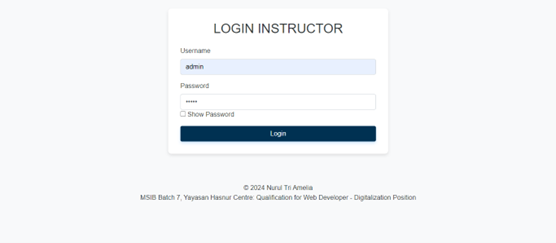 

•	Laman list kursus yang ada 
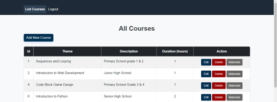 
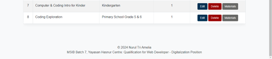 

•	Laman menambahkan kursus baru 
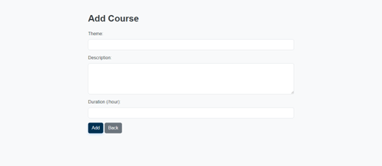 

•	Laman edit kursus 
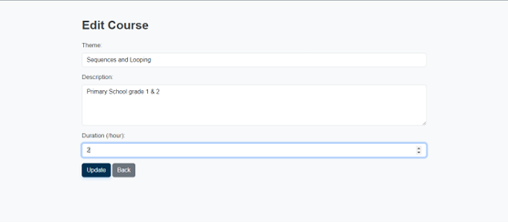 

• Alert update berhasil 
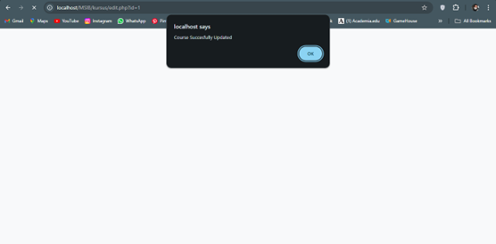 

•	Alert jika kita mencoba delete salah satu kursus 
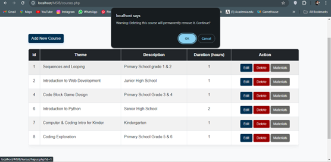 

•	Tampilan jika kita klik tombol materials untuk melihat materi dari kursus yang dipilih  
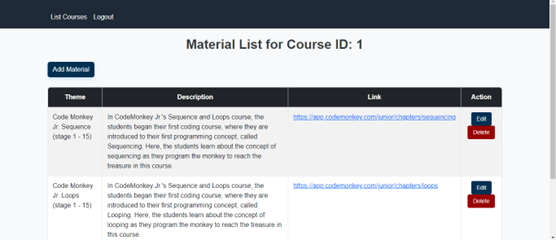 

•	Laman menambahkan materi 
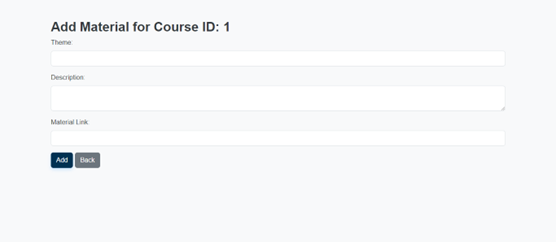 

•	Laman edit materi 
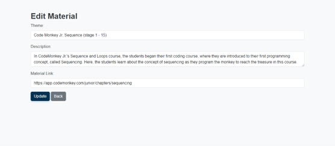 

•   Alert update berhasil 
 

•	Alert jika kita mencoba delete salah satu materi 
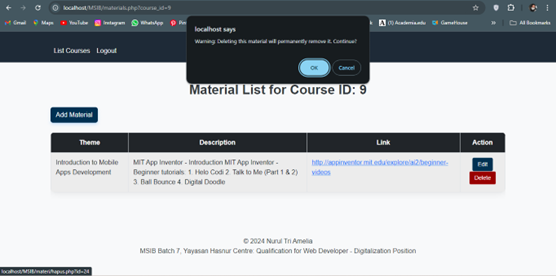 

Laman list materi untuk id kursus 9 yang telah dihapus 
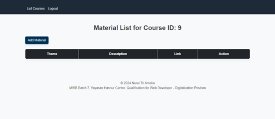 

•	Jika kita klik logout pada nav bar, maka akan kembali ke laman login 
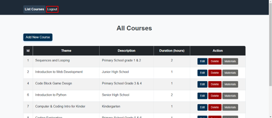 

Last edited 11/08/2024  
By [Nurul Tri Amelia](#)
